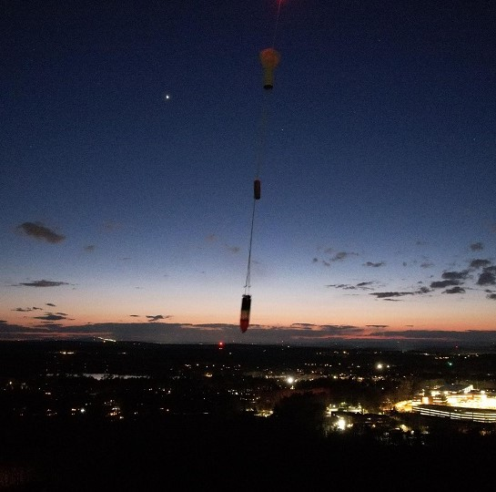
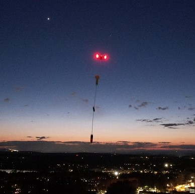
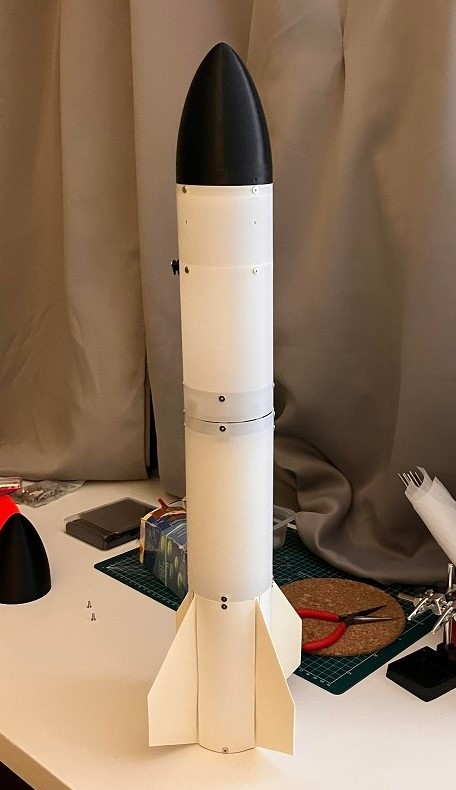
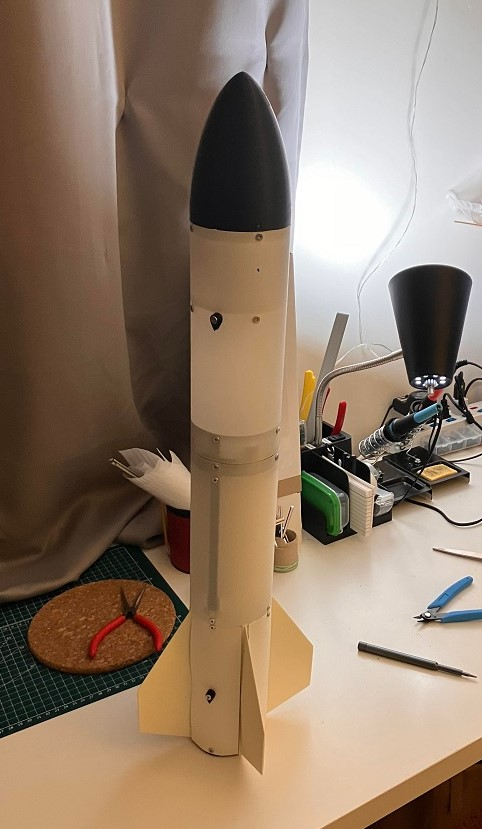
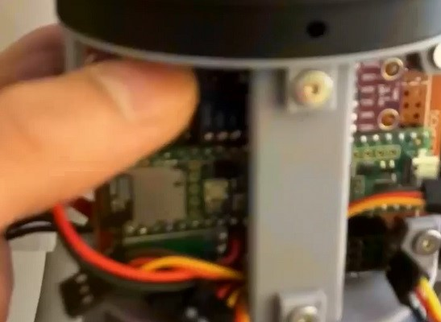
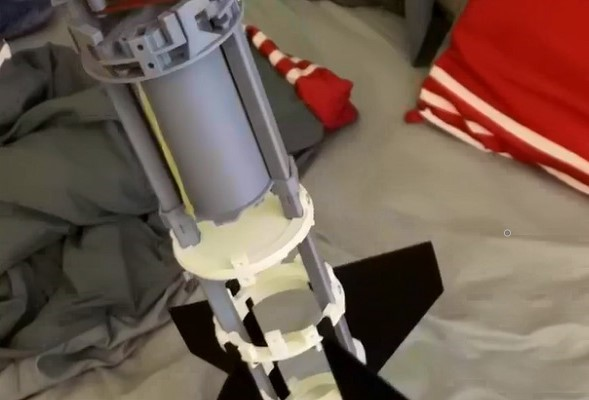
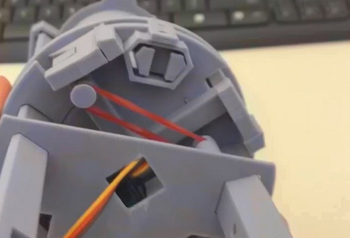
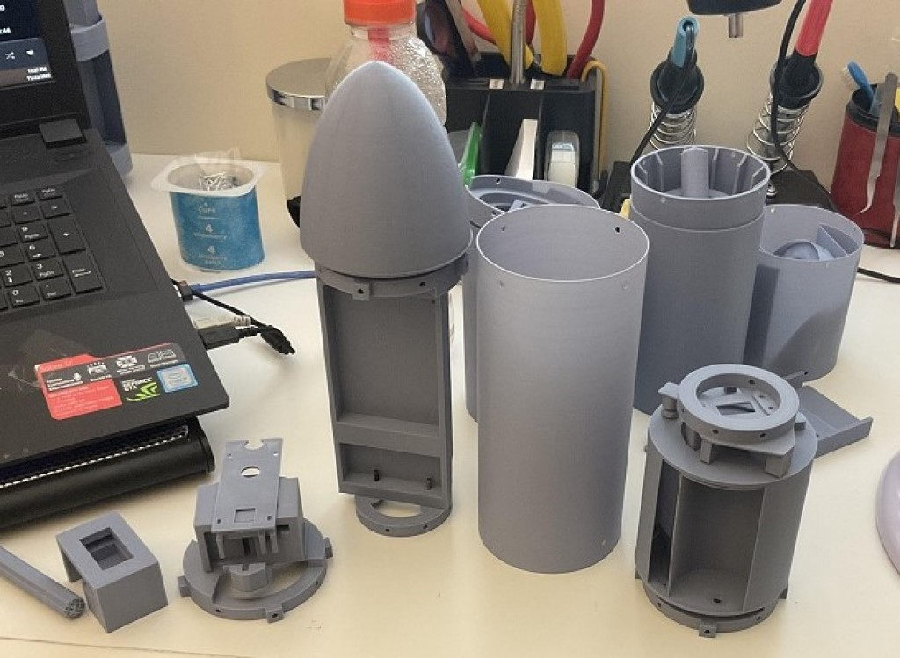
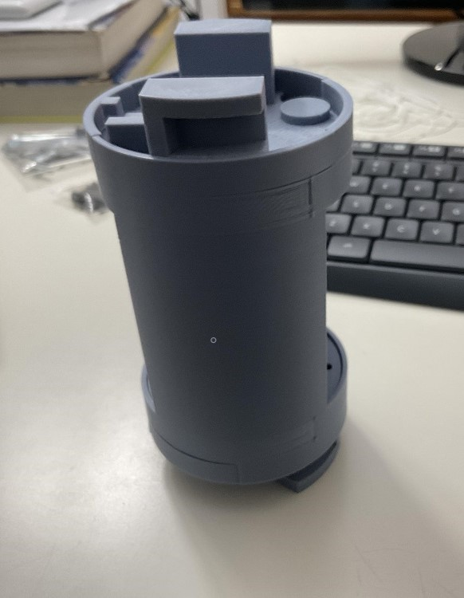

# Rocketry (3D printed)

我是12年級的臭屁儒，不知道為什麼很喜歡做火箭??黑人問號不知道?? 我喜歡設計火箭部件機構，喜歡寫控制程式，喜歡做火箭燃料，喜歡構思自動降落機制。想要學流體力學，想學控制系統，想學飛行載體設計。我參加過三次國際會議，發表一篇論文與兩篇海報，都是與流體、飛行器相關的研究成果。我有Oracle OCAJP、OCPJP與Microsoft AI-900的證照，希望能進修更進階的程式設計技巧與聰明的演算法來控制飛行載體，設計出有趣的飛行器。

## My third design

Final design and the launch test.

### We build the rocket and made a drop test for the parachute at night.

||||||
|:---:|:---:|:---:|:---:|:---:|
||||||
||||||

### In order to reduce the weight, we change some parts

The launch is a long story......!!!
||||||
|:---:|:---:|:---:|:---:|:---:|

### Rocket in actions (Clieck to see video)

| | | | |
|-|-|-|-|
| | | | |

### After few months, miracles happened! These parts droped!

||||||
|:---:|:---:|:---:|:---:|:---:|

## My second design

My second design works fine, but too heavy.

||||
|:---:|:---:|:---:|

## Second design in action (Clieck to see video)
| | | | |
|-|-|-|-|

## My first design

||||||
|:---:|:---:|:---:|:---:|:---:|

||||||
|:---:|:---:|:---:|:---:|:---:|
||||||

### Test 3D printed rocket (Clieck to see video)
| | |
|-|-|

## Sugar rocket fuel experiment

## Parachute design

In order to safely recover the rocket (and protect the cargo inside), we must design a parachute that functions well. I designed several styles and did several experiments.

| | | Clicke to see video Go Lego man| Clicke to see videoGo Lego man| 
|-|-|-|-|

My second design integrated the parachute into my rocket.

| | | | |
|-|-|-|-|

Tests in action. Clicke to see video

| | | | |
|-|-|-|-|
| | | | |
