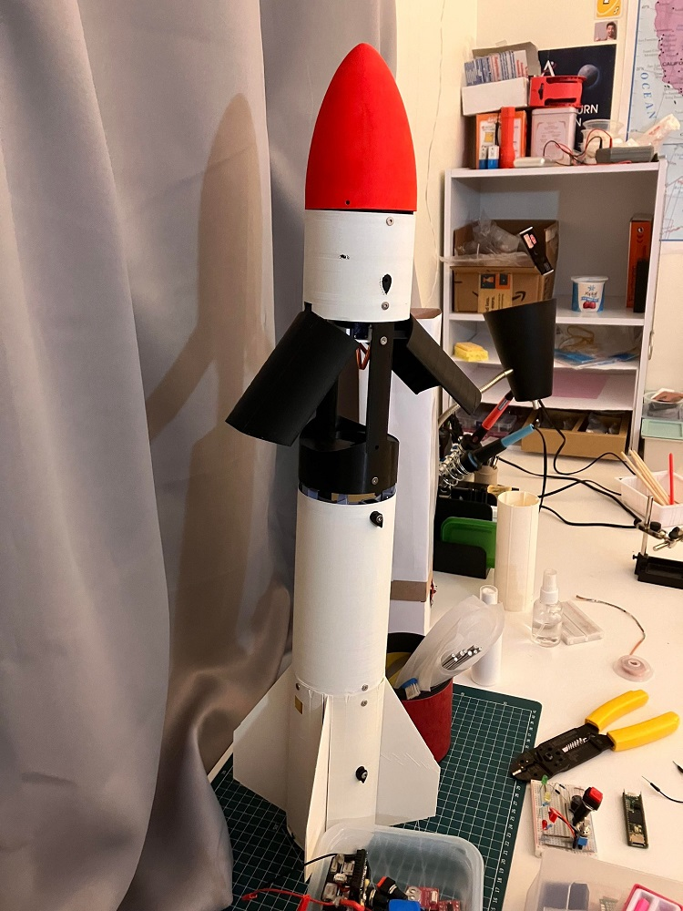
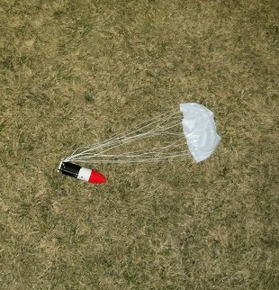
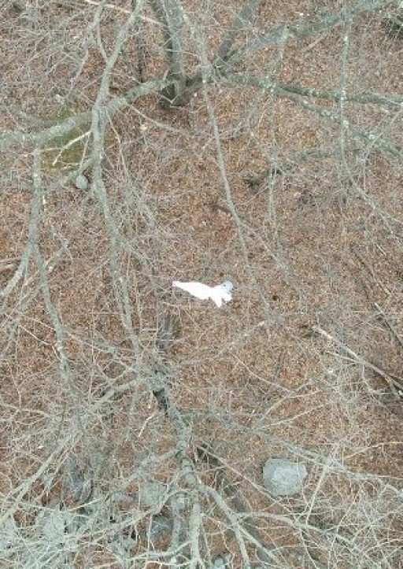
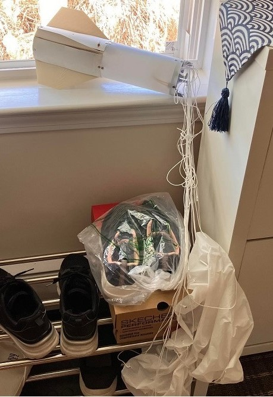
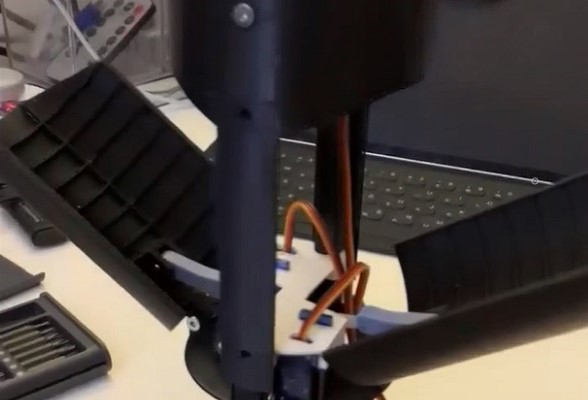
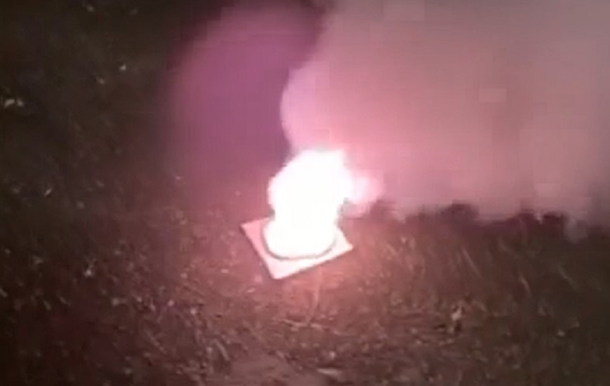
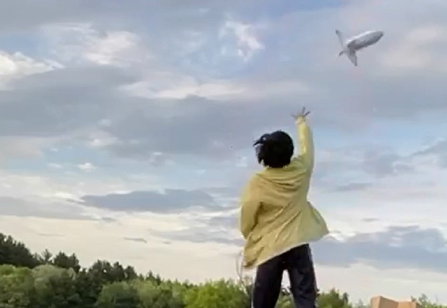

# Rocketry

Here are my progress with doing amateur rocketry. All of the parts are designed in Blender and 3D printed. Onboard microcontrollers started as Arduino UNO and Nanos on my first few test vehicles, and then to Teensy 4.1s on later rockets.

Models and prototypes displayed here are designed around The American Rocketry Challenge (TARC) 2023 guidelines.

## Dusk Parachute Drop Test

Here is one of the first fully assembled prototypes of our rocket. This model that was used to test our parachute deployment and separation system had drag plates that could deploy and retract in flight to actively change the drag of the rocket, thereby adjusting maximum altitude and total flight time.

|||||
|-|-|-|-|
|||||
||||||

## Active Control Model

This model incorporated active fin control, but was never flight tested since the final assembled mass was much greater than the maximum 650g specified by the TARC 2023 requirements. 

||||
|-|-|-|

## Final Model

We had neglected the effects of weather cocking and the rocket ended up getting stuck in a nearby tree after succesful parachute deployment.
|||||
|-|-|-|-|

## Video Demos

Here are a few clips demonstrating the mechanism that deploys the parachute and separates the two stages on the Active Control Model. 

| | | | |
|-|-|-|-|

Here are some short clips demonstrating some of the mechanisms of the Dusk Parachute Drop Test Model and the launch of the Final Model.

| | | | |
|-|-|-|-|

Finally, here are some clips of the numerous recoveries from trees. Thank you so much to the Acton Fire Department for coming out and helping us recover our booster!

| | | | |
|-|-|-|-|

## Second Stage Development

Here are some of the initial designs and protoypes of the Second Stage and its components. 

||||
|-|-|-|

- Initial Chute Deployment Mechanism and Avionics Bay

||||
|-|-|-|
||||

### Second Stage Recovery

During our final launch, the booster and second stage section both got stuck on trees. The fire department was able to help us recover the booster, but not the second stage. After around five months, the wind finally blew down the second stage. Altitude data was recovered and revealed a max altitude of around 180m. 

|||||
|-|-|-|-|

### Video Demos

Here are some clips demonstrating the mechanisms of the first prototype second stage.

| | |
|-|-|

## Sugar Rocket Experiments

As most of you probably know, this popular experiment involves mixing Potassium Nitrate (KNO3) and some sort of sugar at a 65:35 ratio to create your own fuel mixture. 

Here are some pictures of my first attempt at mixing the fuel in a liquid form and then letting it solidify inside the makeshift motor tube.

| | | |
|-|-|-|
||||

## Starlite Experiments

Doing the sugar fuel experiment made me think of ways to make my own solid fuel motor. One of the key components of a rocket motor is the nozzle, which has to be extremely heat resistant. Currently, I only have access to 3D printing as a means of manufacturing this nozzle with custom shape and the plastic filaments for 3D printing have melting points way lower than the combustion temperatures of homemade sugar fuel. 

After watching a [YouTube video by NightHawkInLight](https://youtu.be/0IbWampaEcM?si=IoZrKXtvFoe4xgPj) about the extremely heat resistant material, Starlite, I decided to try it out and see if I could somehow incorporate it in my motor as an insulator.

| | | ||
|-|-|-|-|

### Video Demos

Here are some clips of sugar fuel in powdered form being tested on Starlite.

||||
|-|-|-|

## Initial Parachute Release Prototypes

Here are some of the first ever prototypes I designed to release parachutes before I had access to 3D printing. 

| | |  |
|-|-|-|
|  |  |  |

### Video Demos

Here are some clips showcasing the three parachute release mechanisms.

||| |
|-|-|-|
| |  | |

Here are a few clips of me attempting to test the last two designs in free fall. (I didn't have access to drones at this time)

| | | | |
|-|-|-|-|